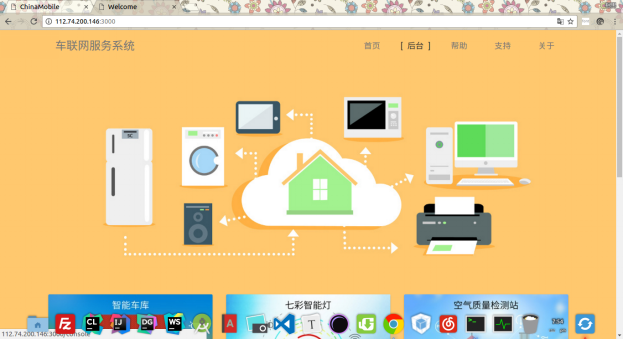
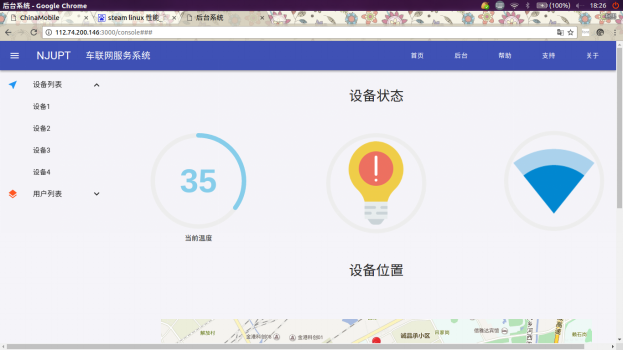
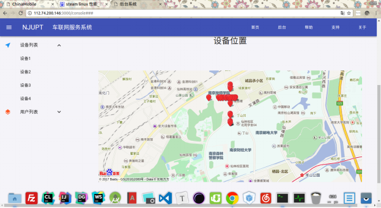
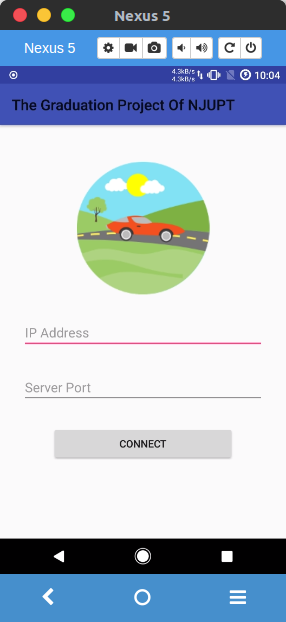
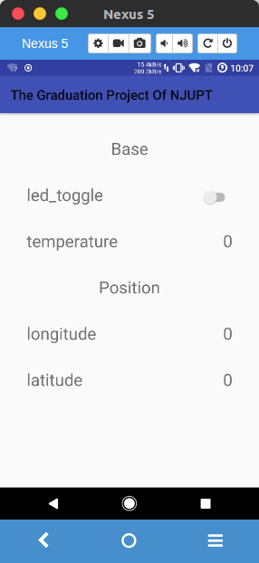

# IOT

## 概况

系统有三部分构成，分别是stm32嵌入式端，web服务端，android移动端。其中web服务端又分为web网页前端和服务后端。实现的主要功能为，stm32端进行传感将当前的位置(即经纬度，通过GUI控件模拟)，温度(通过GUI控件模拟)，led 状态 (板载led)，通过esp8266模块发送给远程的web服务端，web服务端会把数据转发给web前端页面和android移动端。同时也可以通过 android 移动端发送指令通过web服务端的转发控制 stm32 开发板上的 led 灯。从而实现远程监察和控制的功能。

嵌入式端的程序是基于自制的简易的 rtos 和 gui 。

演示视频：https://www.bilibili.com/video/av19237920/

代码：https://github.com/xiangnansong/IOT

## 嵌入式端

嵌入式端基于自制的rtos的gui实现。一共有三个任务：任务一读取嵌入式端的传感数据，任务二用于接受命令，任务三用于界面显示。单片机联网主要使用esp8266模块。

## web端

web前端使用的是mudi框架。web后端使用的是koa.js框架。前端页面可以显示传感信息，并将其位置标注在百度地图，页面为：

主页面

传感信息

位置信息

## android端

android移动端可以查看单片机的状态并对其进行控制

